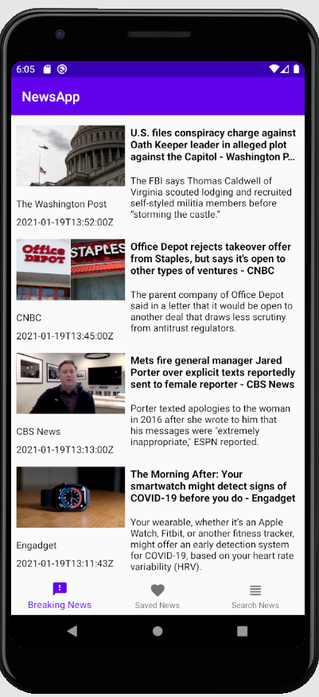
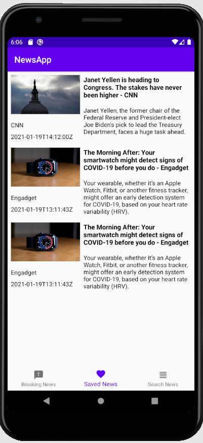

# NewsApp - Android-App      

 ## Discription 
 -------------------------------------------------------
.this is a News app which uses a free news API to load latest newss from all over the world.
.In the home screen the App will display a list of the latest newss and from that the user can select a news and read
 it in a webview. the user can also save a news for reading at a convenient time. 
 in addition the user can also search for a news by typing in the seach box.

---

 ## Technologies   
    
 -----------------------------------------------------
 
- Native android
- Retrofit for a newtwork call
- Room for local storage
- coroutines for background tasks
- Jetpack Navigation Component
- Material design
- Kotlin

 
 |  Min SDK Version | Version Name  | SDK Version |
 | ---------------- |:-------------:| ----------  |
 |  23              |  1.0          |      29     |

 
 

---------------------------------------------------------

## Design pattern /architecture

- Model View ViewModel

-----------------------------------------------------------

 

## photos

---------------------

.  .  .   . 
.    .  . . 

